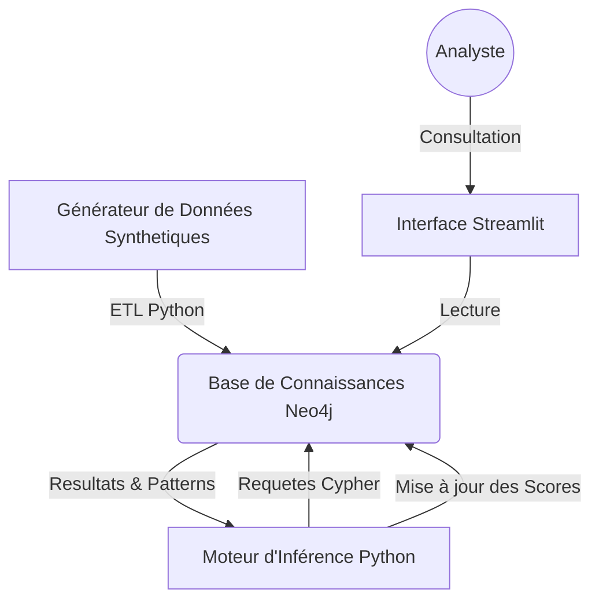

# 🕵️‍♂️ Graph-Based AML Detection System
### Système Expert de Détection de Fraude Financière par Graphe de Connaissances


---

## 📑 Résumé Exécutif

Ce projet est une implémentation d'un **Système à Base de Connaissances (SBC)** appliqué au domaine de la **Lutte Anti-Blanchiment (AML - Anti-Money Laundering)**.

Contrairement aux approches statistiques traditionnelles ("Black Box"), ce système utilise l'**IA Symbolique** et la théorie des Graphes pour modéliser, détecter et expliquer des comportements frauduleux complexes (Smurfing, Cycles de blanchiment) au sein de réseaux de transactions bancaires.

**Contexte Académique :** Projet du module "Ingénierie de la Connaissance" (Niveau GINF3).
**Objectif :** Remplacer les règles rigides des systèmes experts classiques (Prolog) par la flexibilité des bases de données orientées Graphes (**Neo4j**).

---

## 📸 Aperçu du Système

### Dashboard Analyste (Streamlit)
*Interface d'aide à la décision permettant de visualiser les scores de risque et d'explorer le sous-graphe du client.*


---

## 🏗️ Architecture Technique

Le système suit une architecture modulaire et conteneurisée :



### Stack Technologique
| Composant | Technologie | Description |
| :--- | :--- | :--- |
| **SGBD** | **Neo4j** | Stockage du Graphe (Noeuds : Clients, Comptes / Relations : VIREMENT) |
| **Langage** | **Python 3.9** | Logique applicative et orchestration |
| **Inférence** | **Cypher Query Language** | Implémentation des règles métiers (Pattern Matching) |
| **Frontend** | **Streamlit** | Visualisation interactive et Reporting |
| **Visualisation** | **Streamlit-Agraph** | Rendu graphique dynamique (JS) |
| **DevOps** | **Docker** | Conteneurisation de la base de données |

---

## 🧠 Méthodologie et Règles d'Inférence

Le moteur d'inférence (Inference Engine) applique des règles déterministes sur le graphe pour calculer un **Score de Risque**.

### 1. Modélisation Ontologique
Les connaissances sont structurées selon le schéma suivant :
*   `(:Client)-[:POSSEDE]->(:Compte)`
*   `(:Compte)-[:VIRE_VERS {montant, date}]->(:Compte)`
*   `(:Compte)-[:DOMICILIE_CHEZ]->(:Banque)`

### 2. Règles Métiers Implémentées

| Type de Fraude | Règle Logique (Simplifiée) | Implémentation Technique |
| :--- | :--- | :--- |
| **Gros Montants** | Si `montant > 10k€` | Filtrage sur propriété d'arête |
| **Smurfing** | Si `> 5 transactions` de `< 3k€` en peu de temps | Agrégation temporelle et comptage |
| **Cycles de Blanchiment** | Si `A -> B -> C -> A` (Circuit fermé) | Algorithme de détection de cycle (DFS/BFS via Cypher) |
| **Contamination** | Si `A` est frauduleux et `A -> B`, alors `B` est suspect | Propagation de score (Graph Traversal) |

---

## 🚀 Installation et Démarrage

### Prérequis
*   Docker & Docker Compose
*   Python 3.11
*   Git

### 1. Cloner le projet
```bash
git clone https://github.com/8sylla/graph-aml-detection.git
cd graph-aml-detection
```

### 2. Lancer l'infrastructure (Neo4j)
```bash
docker-compose up -d
```
*Accès à la console Neo4j : [http://localhost:7474](http://localhost:7474) (User: `neo4j` / Pass: `password123`)*

### 3. Installer les dépendances
```bash
# Création de l'environnement virtuel (recommandé)
python -m venv venv
source venv/bin/activate  # Sur Windows: venv\Scripts\activate

# Installation des libs
pip install -r requirements.txt
```

### 4. Exécuter le Pipeline complet
Ce script génère les données, les charge dans Neo4j, lance le moteur d'inférence et injecte un cas de fraude test.
```bash
python main.py
```

### 5. Lancer le Dashboard
```bash
streamlit run app.py
```

---

## 📂 Structure du Projet

```text
graph-aml-detection/
├── app.py                # Application Frontend (Streamlit)
├── docker-compose.yml    # Configuration Neo4j
├── main.py               # Orchestrateur du pipeline
├── requirements.txt      # Dépendances
├── src/
│   ├── db_loader.py      # Connecteur Neo4j et chargement (ETL)
│   ├── generator.py      # Générateur de fausses données (Faker)
│   └── inference_engine.py # Cœur du système (Règles Cypher)
└── README.md             # Documentation
```

---

## Scénario de Validation

Pour valider le système, un **"Fraud Ring" (Cercle de Fraude)** artificiel est injecté lors de l'exécution :
1.  **Entités :** M. White, M. Pink, M. Blue.
2.  **Action :** Ils s'envoient de l'argent en cercle (A->B->C->A) pour blanchir des fonds.
3.  **Résultat attendu :**
    *   Le système détecte le cycle.
    *   Le score de risque passe à **CRITICAL** (>50).
    *   Le flag `LAUNDERING_CYCLE` est attribué.
    *   Le réseau est visible en rouge sur le dashboard.

---

## 🔮 Perspectives d'amélioration

*   **GraphRAG :** Connecter un LLM (OpenAI/Mistral) pour générer des rapports textuels automatiques à partir du sous-graphe suspect.
*   **Graph Neural Networks (GNN) :** Utiliser `GraphSAGE` pour prédire de nouveaux liens de fraude inconnus (Approche hybride Symbolique/Connexionniste).
*   **Temps réel :** Connecter le système à un flux Kafka pour analyser les transactions à la volée.

